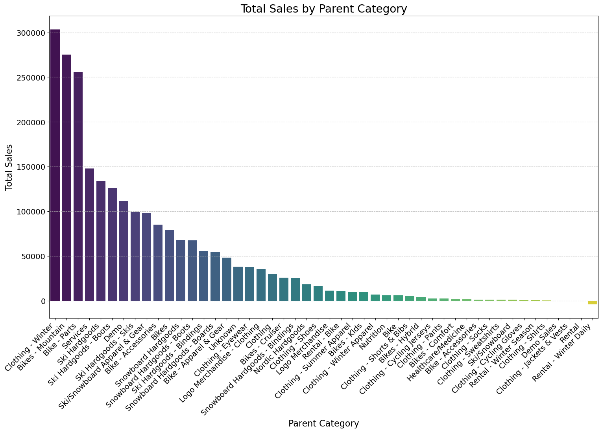
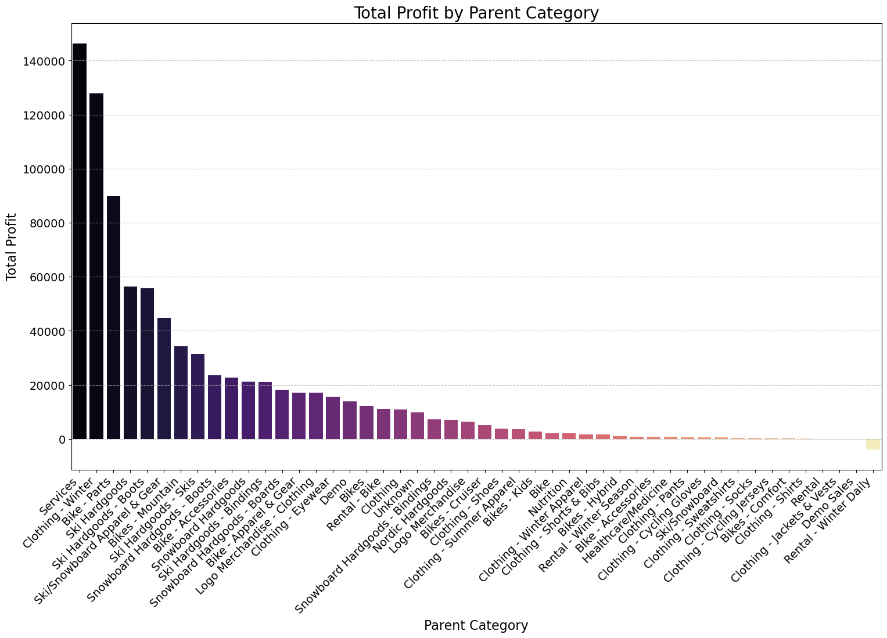
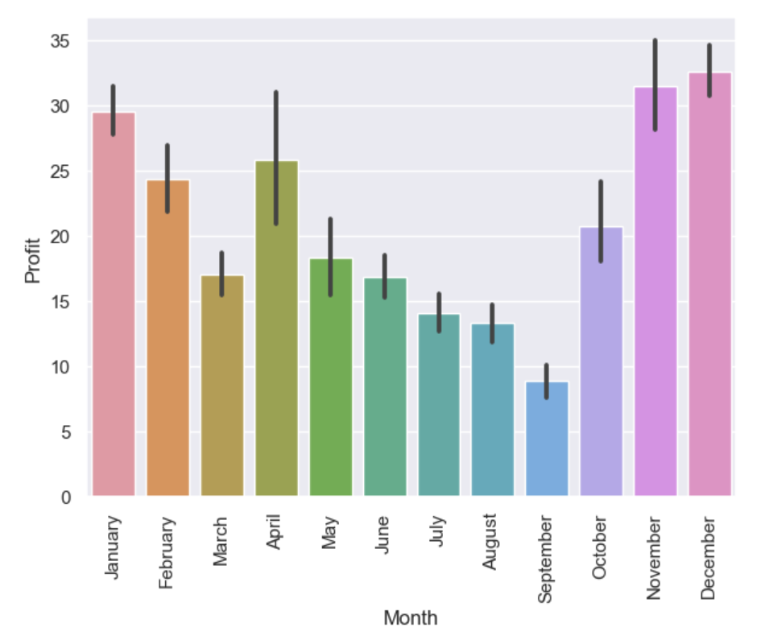

<div align="center">


# 🏔️ Sunlight Ski & Bike — Retail Intelligence

### Turning a messy point-of-sale export into clean categories, sharp insights, and smarter buying decisions.

[](https://www.python.org/)
[](https://pandas.pydata.org/)
[](https://scikit-learn.org/)
[](https://jupyter.org/)
[](./LICENSE)

</div>

---

## ⛷️ The Story

**Sunlight Ski and Bike** is a beloved local shop in Glenwood Springs, Colorado. Like most small specialty retailers, it ran on instinct and sales-rep suggestions for seasonal buying. The problem? The product data was a mess — **free-text categories, inconsistent brands, dirty sizes, and thousands of missing labels** — which made it nearly impossible to answer simple questions like *"What actually sells, and what actually makes us money?"*

This project takes the raw POS export, **cleans and re-classifies it into a usable schema**, and then mines it for the insights that drive better inventory and pricing decisions.

> **TL;DR** — We collapsed messy free-text categories into **10 clean parent categories**, standardized **56 brands**, and surfaced clear seasonal, vendor, and margin patterns the shop can buy against.

---

## 🎯 Questions We Set Out to Answer

- 🧹 Can we automatically **clean and classify** thousands of inconsistently-labeled products?
- 🥇 Which **categories and brands** drive sales and profit?
- 📅 How **seasonal** is the business, and when should we stock up?
- 💸 Where are we **giving away margin** — and where are we protecting it?

---

## 📦 The Data

The starting point was a raw inventory/sales export — **wide, sparse, and inconsistent**. Many columns were stored as text, `Category` was missing on roughly a third of rows, and `Sale Price` was almost entirely empty.

<div align="center">

</div>

| | |
|---|---|
| **Products analyzed** | ~4,400 cleaned product rows |
| **Parent categories (after cleanup)** | 10 |
| **Distinct brands (standardized)** | 56 |
| **Median MSRP** | \$109.50 |
| **Mean MSRP** | \$172.97 |
| **Price range** | \$0 – \$7,999 |

---

## 🧹 Step 1 — From Chaos to Clean Categories

The original `Category` field was free text with hundreds of inconsistent, overlapping, and misspelled values. We engineered a **`ParentCategory`** hierarchy and used text-based machine learning to fill the gaps.

**Approach:** product descriptions were tokenized and vectorized (Bag-of-Words / TF-IDF), then a tree-based classifier predicted the correct category for unlabeled items.

<div align="center">

</div>

> 📌 **Result:** a clean, 10-category scheme — *Accessories, Clothing, Snowboard Hardgoods, Ski Hardgoods, Cross Country, Logo Merchandise, Bikes, Parts,* and more — that makes every downstream report trustworthy.

---

## 📊 What the Data Told Us

### 1. 📅 The business is intensely seasonal — and December is king

<div align="center">

</div>

Sales spike to **~\$300K in December** — nearly double the off-season baseline — driven by the ski/holiday rush. A **secondary peak in August (~\$208K)** reflects the summer bike season. The clear troughs in **September, April, and November** are the shoulder months between sports.

> 🔑 **Conclusion:** This is a two-season business (winter snow + summer bike) with sharp transitions. Inventory and cash should be loaded *ahead* of the Aug and Dec peaks and lean during the Sept/April shoulders.

### 2. 🏷️ Sales are highly concentrated in a few vendors

<div align="center">

</div>

The top vendor accounts for roughly **\$580K in sales — about 2.4× the next-largest** — and the curve drops off steeply. A handful of suppliers (Amer Sports / Salomon, Trek, Burton, K2, Smith) carry the bulk of revenue, with a long tail of minor vendors.

> 🔑 **Conclusion:** Vendor relationships are a **leverage point**. Negotiating better terms, co-op marketing, or volume discounts with the top 5 vendors moves the needle far more than tweaking the long tail.

### 3. 🛍️ Accessories and Clothing dominate the catalog

<div align="center">

</div>

By volume, **Accessories (~1,690 products)** and **Clothing (~1,560)** make up the majority of the catalog, followed by **Snowboard Hardgoods** and **Ski Hardgoods**. Top brands by product count: **Burton (665), Dakine (599), Salomon (364), Armada (285), and Airblaster (277).**

### 4. 💰 Profit doesn't follow sales volume

<div align="center">

</div>
<div align="center">

</div>

Total profit is led by **hardgoods and apparel**, but the *highest-margin* lines are **rentals, services, lift tickets, and logo merchandise** — items with little or no cost of goods. High-ticket hardgoods (bikes, skis) move dollars but at thinner margins.

> 🔑 **Conclusion:** Volume ≠ profit. The shop should **protect and grow the high-margin service/rental/logo lines** while using hardgoods primarily as traffic-and-revenue drivers.

### 5. 📉 Margins are bimodal — and there's leaking profit

<div align="center">

</div>
<div align="center">

</div>

Margins cluster around a **healthy ~48–50% median**, with a spike near **0–10% (clearance/closeout)** and another near **100% (zero-COGS services)**. The box plot reveals a **negative-margin tail** — products sold *below cost*.

> 🔑 **Conclusion:** A meaningful slice of inventory is being **discounted into the red**. Tightening markdown rules on these SKUs is an immediate, no-new-inventory profit win.

### 6. 🗓️ Margin quality is best in the cold months

<div align="center">

</div>

Average per-unit profit peaks in **November–January** and bottoms out in **late summer (September)** — winter buyers pay closer to full price, while summer is more discount-driven.

> 🔑 **Conclusion:** Resist over-discounting in the strong winter window; deploy promotions strategically in the soft shoulder months instead.

---

## 🧠 Step 2 — Predictive Pricing

Beyond classification, we modeled **Sale Price** to support data-driven pricing:

| Model | RMSE | R² |
|------------------------|-------|------|
| Linear Regression | 20.45 | 0.82 |
| **Random Forest Regressor** | **18.30** | **0.85** |

The Random Forest captures the non-linear relationships between brand, category, and price, explaining **85% of price variance** — a solid foundation for price-optimization and demand-forecasting work.

---

## ✅ Recommendations at a Glance

| # | Recommendation | Why |
|---|----------------|-----|
| 1 | **Buy and stock ahead of the Aug & Dec peaks** | Sales nearly double; stockouts here cost the most |
| 2 | **Negotiate hard with the top 5 vendors** | ~80% of revenue flows through them |
| 3 | **Grow high-margin rentals, services & logo gear** | Profit ≠ volume; these have near-100% margin |
| 4 | **Fix the negative-margin SKUs** | Stop selling below cost via smarter markdown rules |
| 5 | **Hold the line on discounts in winter** | Margin quality is highest Nov–Jan |

---

## 🗂️ Repository Structure

```
SunlightMtnRetail/
├── notebooks/          # The full analysis journey (cleaning → wrangling → modeling)
│   ├── 01-data-cleaning.ipynb
│   ├── 02-data-wrangling-clean-data.ipynb
│   ├── 02a-brand-clean-up.ipynb
│   ├── 03-data-training-categories.ipynb
│   └── 04-data-modeling.ipynb
├── reports/
│   ├── report.md       # Full written capstone report
│   └── figures/        # All visualizations
├── src/                # Reusable data / feature / model / viz code
├── models/             # Reference product datasets
├── references/         # Supporting material
├── requirements.txt
└── README.md
```

## 🚀 Getting Started

```bash
# 1. Clone the repo
git clone https://github.com/MappingKat/sunlightmtnretail.git
cd sunlightmtnretail

# 2. Install dependencies
pip install -r requirements.txt

# 3. Explore the analysis
jupyter notebook notebooks/
```

## 🛠️ Built With

`Python` · `pandas` · `NumPy` · `scikit-learn` · `matplotlib` · `seaborn` · `Jupyter`

---

## 📖 Read More

📄 The full written analysis lives in **[reports/report.md](./reports/report.md)**.

## 📜 License

Released under the [MIT License](./LICENSE).

<div align="center">

*Built with ❄️ and 🚲 for the crew at Sunlight Ski & Bike, Glenwood Springs, CO.*

</div>
