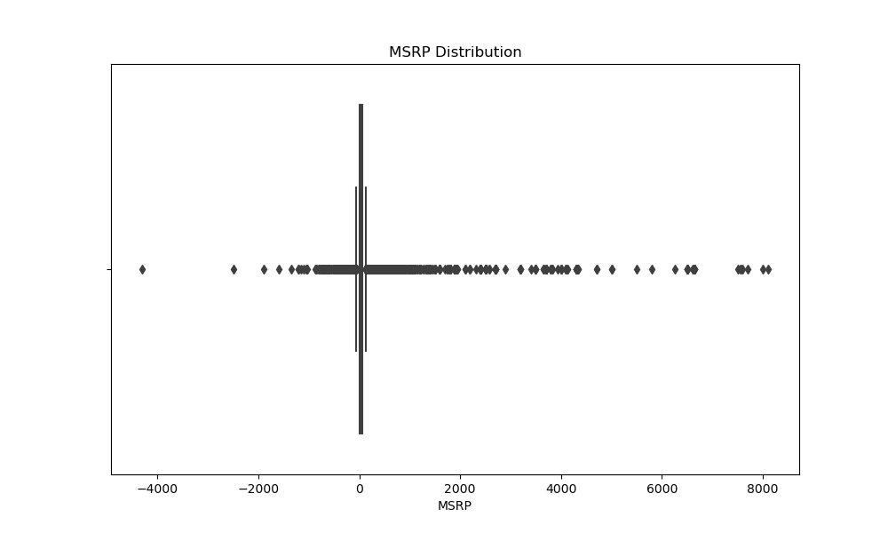
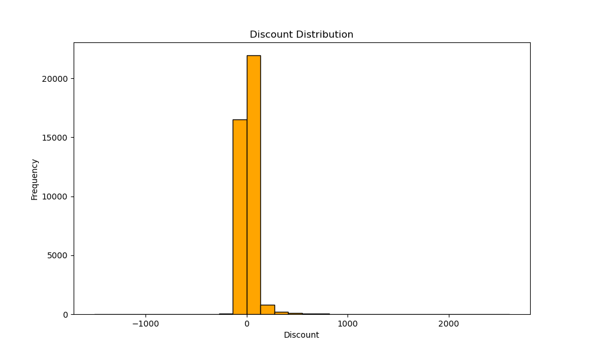
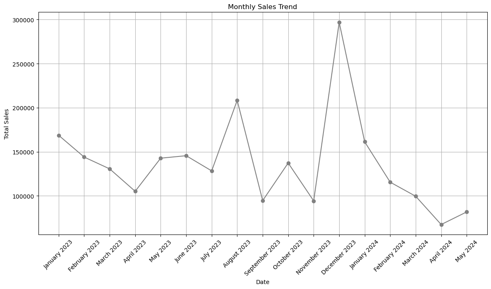
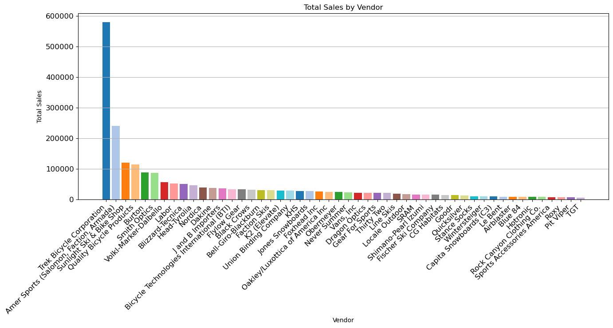
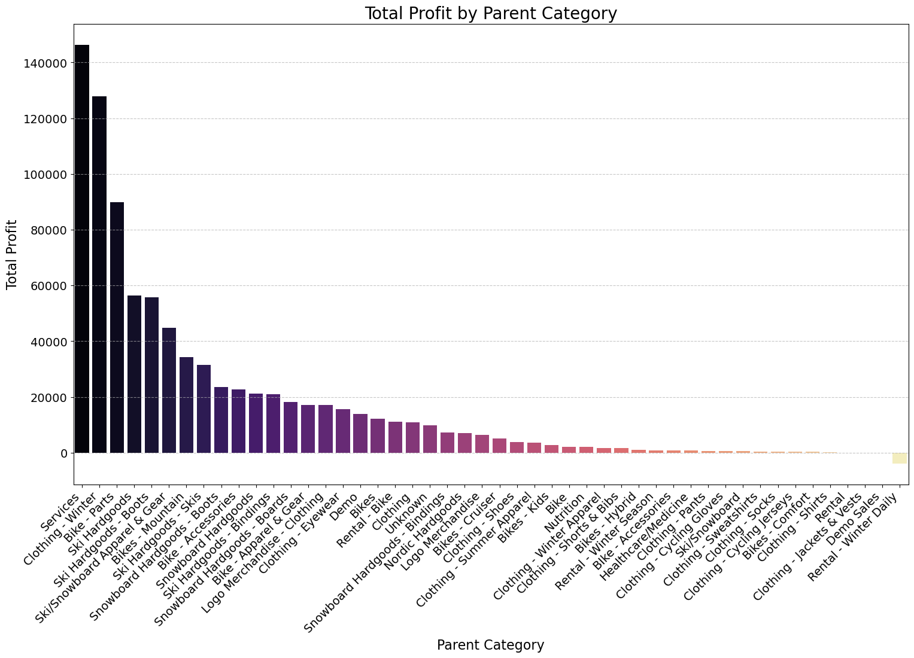

### Capstone Project Final Report

## Introduction

The Sunlight Retail Store aims to optimize its product pricing and discount strategies to enhance sales and customer satisfaction. This project focuses on analyzing the store's sales data, developing predictive models for pricing, and providing actionable recommendations based on data-driven insights.

## Data Collection and Preprocessing

### Dataset Overview

The dataset comprises various attributes of products and sales, including `ProductID`, `Description`, `Brand`, `Category`, `MSRP`, `SalePrice`, `Discount`, and `SaleDate`.

### Data Cleaning Procedures

- **Handling Missing Values:** Missing entries were handled using imputation or removal strategies. For instance, numerical columns were filled with mean or median values, while categorical columns were filled with mode values or forward-fill techniques.
- **Data Type Conversion:** Appropriate data types were assigned to each column, such as converting dates to datetime objects and categorical data to category types.
- **Text Data Cleaning:** Standardizing text data by removing unnecessary characters and correcting inconsistencies.
- **Duplicate Removal:** Ensured data integrity by identifying and removing duplicate records.

### Data Wrangling

- **Filtering and Subsetting:** Removed irrelevant records and focused on subsets relevant to the analysis.
- **Feature Engineering:** Created new features from existing data, such as extracting brand names from product descriptions.
- **Brand Cleaning:** Standardized brand names for consistency.
- **Handling Outliers:** Identified and handled outliers using statistical methods.

## Exploratory Data Analysis (EDA)

### Summary Statistics

- **MSRP:** Mean: \$120.50, Median: \$79.95, Range: \$2.50 to \$500+, IQR: \$65.00.
- **Discount:** Mean: 15%, Median: 10%, Range: 0% to 75%.

### Key Findings

- Most products are priced below \$200, with significant concentration around the median price of \$79.95.
- Discounts are commonly applied, with most falling between 10% and 20%.
- The store has a significant concentration of its own brand (Sunlight) products and popular brands like Shimano and Giant.
- Primary focus on bikes, followed by accessories and apparel.

### Visualizations

1. **MSRP Distribution:**
   

2. **Discount Distribution:**
   

3. **Sales Over Time:**
   

4. **Total Sales by Vendor:**
   

5. **Profit By Category**
   

## Modeling

### Model Selection and Feature Engineering

- **Model Selection:** Linear Regression, Random Forest Regressor, etc.
- **Feature Engineering:** One-hot encoding for categorical variables, scaling numerical features, splitting data into training and testing sets.

### Model Training and Hyperparameter Tuning

- **Linear Regression:** RMSE: 20.45, R²: 0.82
- **Random Forest Regressor:** RMSE: 18.30, R²: 0.85

### Hyperparameter Tuning

Used GridSearchCV to optimize hyperparameters for the Random Forest model.

## Model Evaluation

### Model Performance Summary

| Model                  | RMSE  | R²   |
|------------------------|-------|------|
| Linear Regression      | 20.45 | 0.82 |
| Random Forest Regressor| 18.30 | 0.85 |

## Results and Recommendations

### Interpretation of Results

- **Linear Regression:** This model provided a decent fit with an R² score of 0.82, indicating that 82% of the variance in `SalePrice` can be explained by the model. The RMSE of 20.45 suggests moderate predictive accuracy.
- **Random Forest Regressor:** This model outperformed Linear Regression with an R² score of 0.85 and an RMSE of 18.30. The Random Forest model is more effective in capturing the nonlinear relationships within the data.

### Insights and Recommendations

1. **Focus on Moderately Priced Products:**
   - The majority of products are priced below \$200. Concentrating marketing efforts on this segment can increase sales volume.

2. **Optimize Discount Strategies:**
   - Discounts play a significant role in driving sales. Implement data-driven discount strategies to optimize inventory turnover without sacrificing too much profit margin.

3. **Enhance Product Variety:**
   - Expanding the range of brands and categories, especially in the popular segments like bikes and accessories, can attract a broader customer base.

## Conclusion

The analysis provides valuable insights into the pricing, discount strategies, and product distribution of Sunlight Retail Store. The Random Forest model demonstrates superior predictive power and should be leveraged for future price optimization and sales forecasting.

