# Sunlight Ski & Bike — Capstone Final Report

### Optimizing Inventory, Pricing & Categorization with Data

---

## 1. Introduction

Sunlight Ski and Bike is a small, well-loved specialty retailer in Glenwood Springs, Colorado. Historically, seasonal buying decisions were driven by sales-rep suggestions and gut feel rather than data — largely because the store's product data was too messy to report on reliably.

This project had two goals:

1. **Clean and re-classify** the product catalog into a consistent, reportable schema using machine learning.
2. **Mine the cleaned data** for the seasonal, vendor, category, and margin patterns that should drive inventory and pricing decisions.

---

## 2. Data Collection & Preprocessing

### Dataset Overview

The raw export was wide and sparse. Core attributes included `Description`, `Brand`, `Category`, `MSRP`, `Cost`, `Sale Price`, `Quantity`, `Size`, `Color`, `SKU`, and date fields. Several columns were stored as text, `Category` was missing on roughly a third of rows, and `Sale Price` was almost entirely empty.

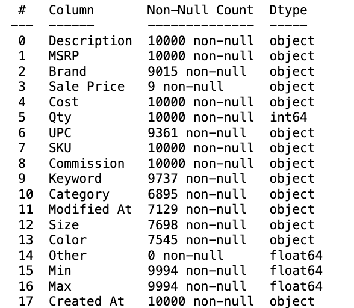

After filtering to usable rows, the analysis covers **~4,400 products across 10 clean parent categories and 56 standardized brands.**

### Data Cleaning Procedures

- **Missing values** — numeric fields imputed with mean/median; categoricals filled with mode or a `"missing"` sentinel; rows with no recoverable category set aside for the classification step.
- **Type conversion** — text-stored numerics (MSRP, Cost) coerced to floats; dates parsed to `datetime`.
- **Text standardization** — descriptions lower-cased, punctuation stripped, and tokenized for modeling.
- **Brand cleaning** — inconsistent and misspelled brand strings collapsed into 56 canonical brands.
- **Size normalization** — the `Size` field mixed letters, numbers, and weights; it was parsed into a clean ordinal scale (`S → M → L → XL → XXL`, plus `OS` and youth sizes).
- **Duplicate removal** — identical records de-duplicated to protect aggregate totals.

### Size Cleanup Result

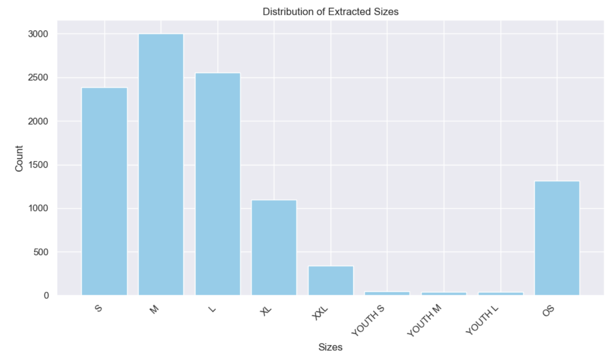

After normalization, sizing follows the expected retail curve: **Medium is the most common size, followed by Large and Small**, with a meaningful block of one-size (`OS`) accessories. This is the kind of clean, sortable field that was impossible to report on before.

---

## 3. Re-Classifying the Catalog (Core ML Task)

The original `Category` field was free text with hundreds of overlapping, inconsistent values, and was missing entirely on many rows. We engineered a **`ParentCategory`** hierarchy and trained text classifiers to predict the correct category from each product's description.

**Pipeline:** descriptions were vectorized with Bag-of-Words / TF-IDF, then fed to a range of classifiers. We benchmarked traditional ML models against embedding-based approaches.

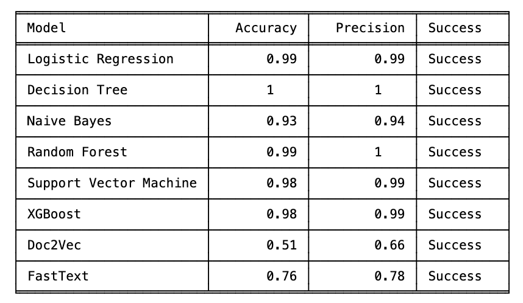

| Model | Accuracy | Precision |
|-------------------------|:--------:|:---------:|
| **Decision Tree** | **1.00** | **1.00** |
| Logistic Regression | 0.99 | 0.99 |
| Random Forest | 0.99 | 1.00 |
| Support Vector Machine | 0.98 | 0.99 |
| XGBoost | 0.98 | 0.99 |
| Naive Bayes | 0.93 | 0.94 |
| FastText | 0.76 | 0.78 |
| Doc2Vec | 0.51 | 0.66 |

> **Winner:** the tree-based and linear models (Decision Tree, Logistic Regression, Random Forest) classified products from their descriptions with near-perfect accuracy. The embedding methods (Doc2Vec, FastText) under-performed — unsurprising given the short, keyword-dense product descriptions, where exact tokens carry more signal than learned semantics.

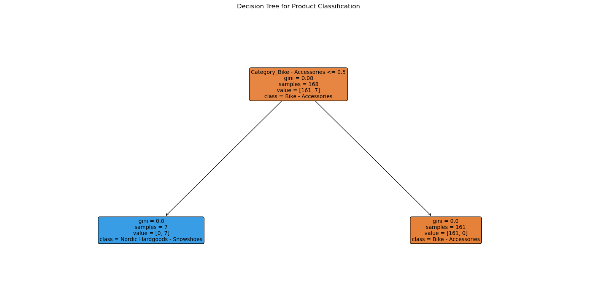

The interpretable decision tree confirms *why* this works: category-defining keywords (e.g. *bike*, *snowboard*, *snowshoe*) split the classes cleanly with very low impurity.

**Outcome:** a trustworthy 10-category scheme — *Accessories, Clothing, Snowboard Hardgoods, Ski Hardgoods, Cross Country, Logo Merchandise, Bikes, Parts, Winter Demo,* and *Summer Demo* — that makes every downstream report reliable.

---

## 4. Exploratory Data Analysis

### Summary Statistics

| Metric | MSRP | Discount |
|--------|------|----------|
| Mean | \$172.97 | ~15% |
| Median | \$109.50 | ~10% |
| Range | \$0 – \$7,999 | 0% – 75% |

### 4.1 Catalog Composition

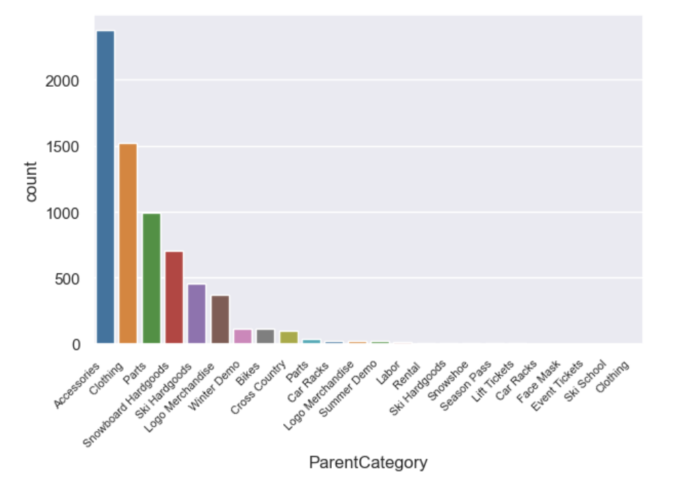

**Accessories (~1,690 products)** and **Clothing (~1,560)** dominate the catalog, followed by **Snowboard Hardgoods** and **Ski Hardgoods**. The top brands by product count are **Burton (665), Dakine (599), Salomon (364), Armada (285), and Airblaster (277)** — a snow-sports-led assortment with a deep accessory tail.

### 4.2 Pricing by Category

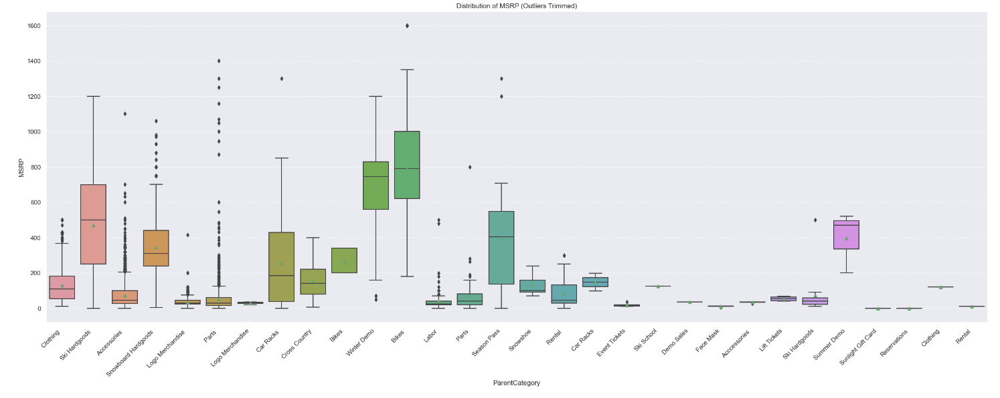

Price points vary sharply by category. **Bikes, Winter Demo, and Season Passes** carry the highest MSRPs (medians from ~$400 up past $800), while **Accessories, Parts, and Logo Merchandise** sit at the low end. This spread is exactly why a clean category field matters: a single "average price" hides wildly different product economics.

### 4.3 Seasonality — A Two-Season Business

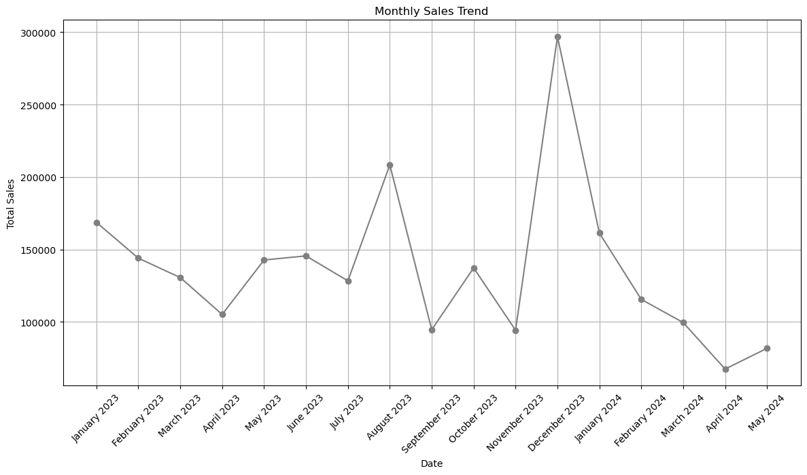

Total sales spike to **~\$300K in December** — nearly double the off-season baseline — driven by the ski/holiday rush, with a **secondary peak in August (~\$208K)** from the summer bike season. Clear troughs appear in the **September, April, and November** shoulder months.

### 4.4 Vendor Concentration

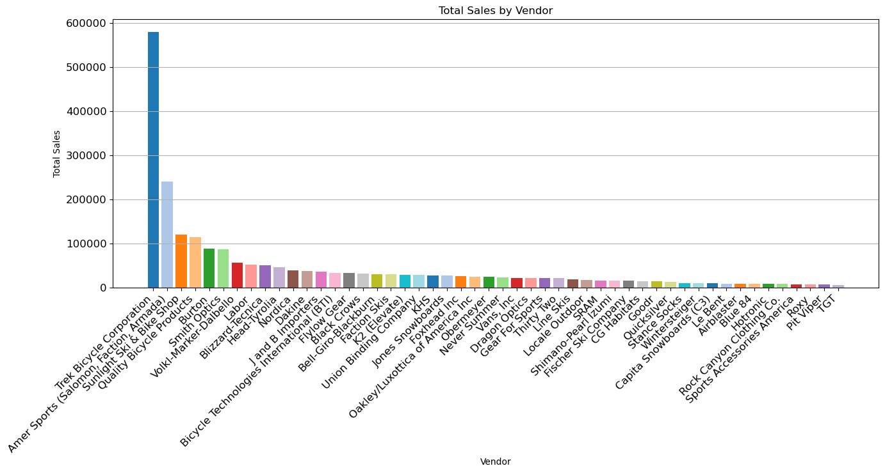

Revenue is highly concentrated: the top vendor drives roughly **\$580K — about 2.4× the second-largest** — and the curve drops off steeply. A handful of suppliers (Amer Sports / Salomon, Trek, Burton, K2, Smith) carry the bulk of sales, with a long tail of minor vendors.

---

## 5. Profit & Margin Analysis

### 5.1 Profit Doesn't Follow Volume

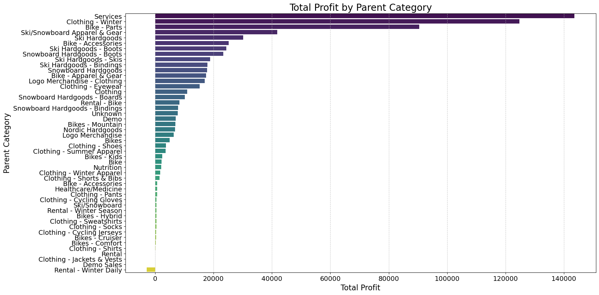
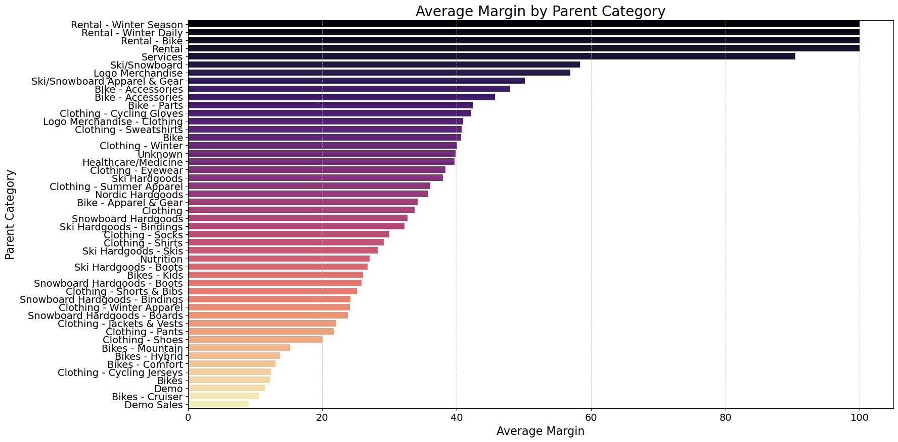

Total profit is led by **services, winter clothing, and hardgoods**, but the *highest-margin* lines are **rentals, services, lift tickets, and logo merchandise** — items with little or no cost of goods. High-ticket hardgoods (bikes, skis) move dollars but at thinner margins.

### 5.2 Margins Are Bimodal — and Leaking

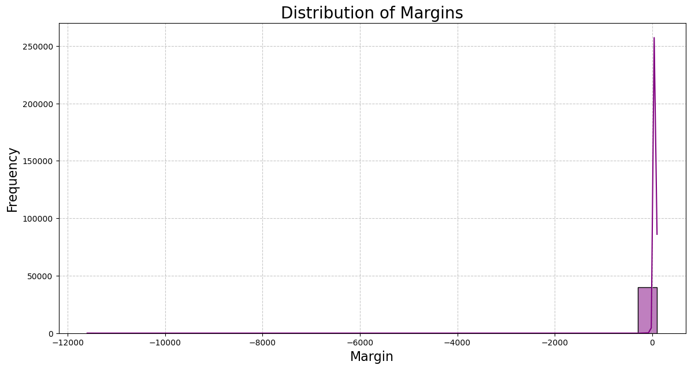
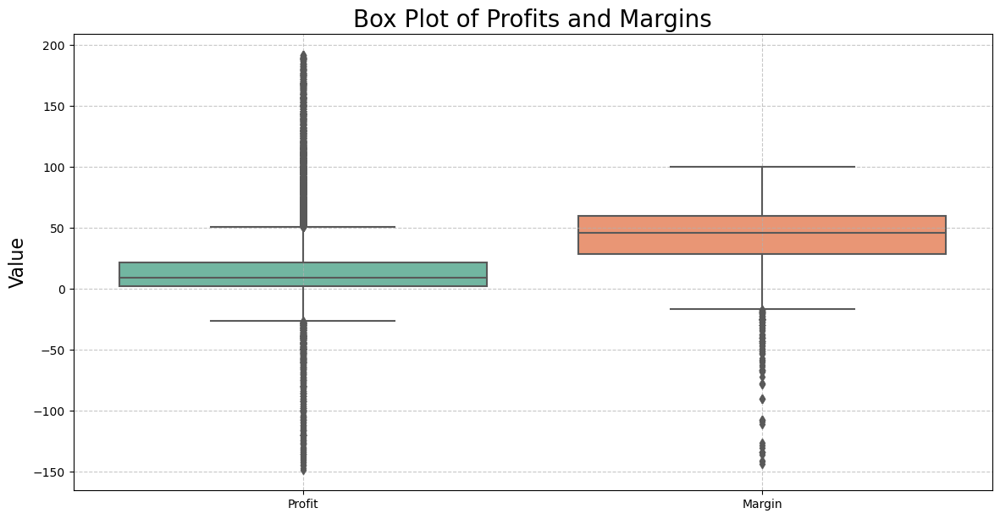

Margins cluster around a **healthy ~48–50% median**, with a spike near **0–10% (clearance/closeout)** and another near **100% (zero-COGS services)**. Critically, the box plot reveals a **negative-margin tail — products sold below cost.**

### 5.3 Margin Quality Is Best in the Cold Months

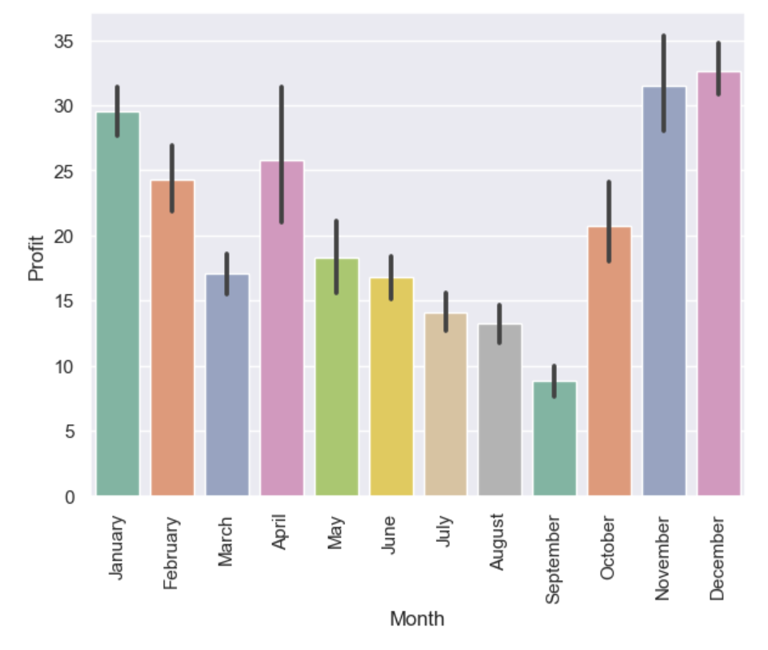

Average per-unit profit peaks in **November–January** and bottoms out in **late summer (September)**: winter buyers pay closer to full price, while summer is more discount-driven.

### 5.4 Discounts Are Modest but Long-Tailed

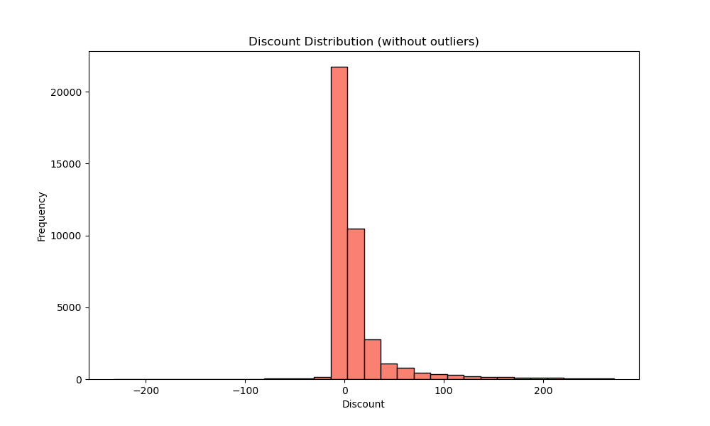

Most transactions carry small discounts clustered near zero, but a long right tail of deep markdowns is exactly where the negative-margin sales hide.

---

## 6. Predictive Pricing (Extension)

Beyond classification, we modeled **Sale Price** to support data-driven pricing using brand, category, and product attributes.

| Model | RMSE | R² |
|------------------------|:-----:|:----:|
| Linear Regression | 20.45 | 0.82 |
| **Random Forest Regressor** | **18.30** | **0.85** |

Hyperparameters were tuned with `GridSearchCV`. The Random Forest captures the non-linear relationships between brand, category, and price, explaining **85% of price variance** — a solid foundation for future price-optimization and demand-forecasting work.

---

## 7. Results & Recommendations

| # | Recommendation | Rationale |
|---|----------------|-----------|
| 1 | **Buy and stock ahead of the Aug & Dec peaks** | Sales nearly double in these months; stockouts here are the most costly. |
| 2 | **Negotiate harder with the top 5 vendors** | The bulk of revenue flows through a handful of suppliers — the main pricing/terms lever. |
| 3 | **Grow high-margin rentals, services & logo gear** | Profit ≠ volume; these near-100%-margin lines are under-leveraged. |
| 4 | **Fix the negative-margin SKUs** | A real slice of inventory sells below cost; tighter markdown rules are an immediate profit win. |
| 5 | **Hold the line on discounts in winter** | Per-unit margins are strongest Nov–Jan; concentrate promotions in the soft shoulder months. |

---

## 8. Conclusion & Next Steps

By cleaning a chaotic POS export and re-classifying it with high-accuracy text models, this project turned an un-reportable dataset into a clear strategic picture: a **two-season business** with **concentrated vendor revenue**, **category economics that diverge sharply from sales volume**, and **identifiable margin leakage** that can be fixed without buying a single new product.

**Future work:**

- Demand forecasting per category to automate seasonal buying.
- A markdown-optimization model to eliminate below-cost sales.
- Personalized product recommendations from purchase history.
- Re-running classification on the previously-uncategorized backlog now that the schema is proven.
